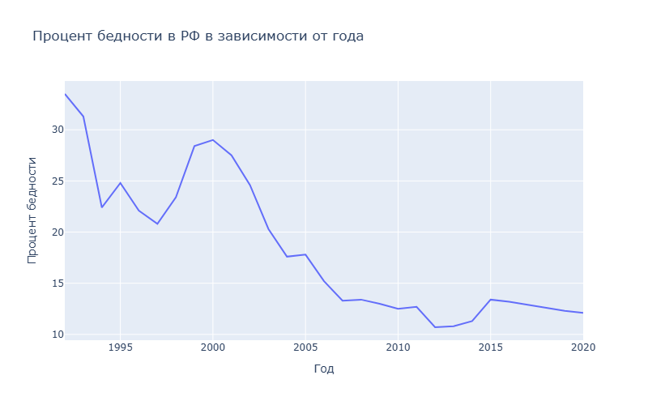
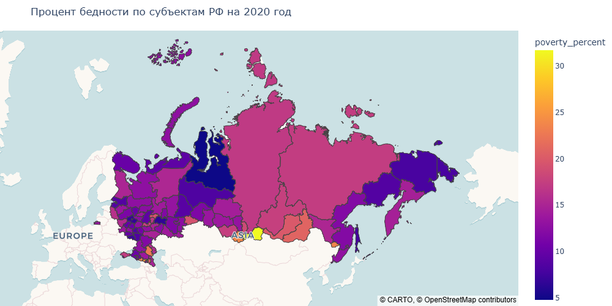
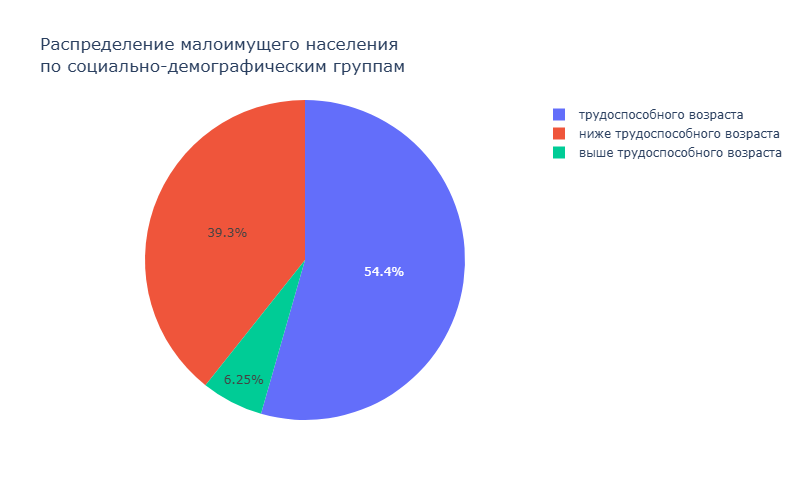
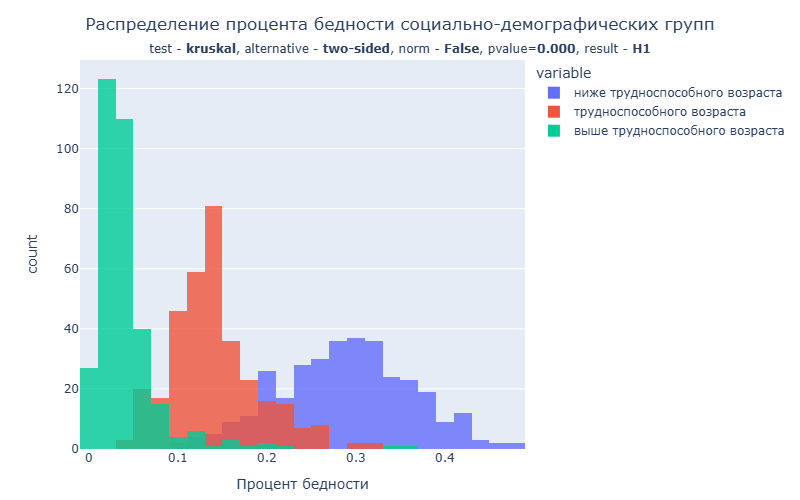
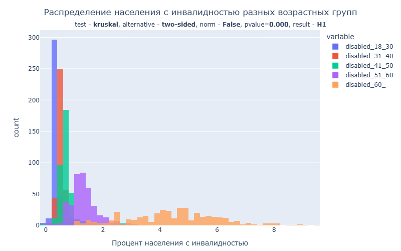
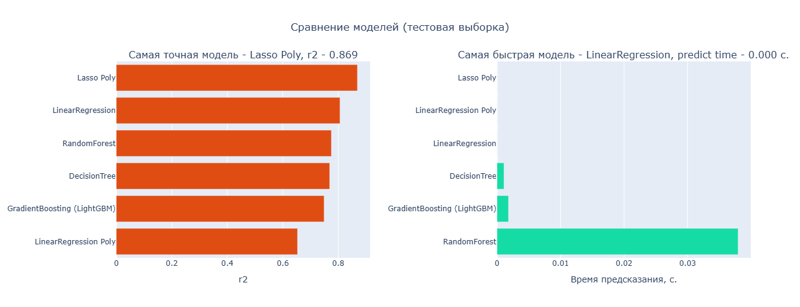

# Определение уязвимых групп населения

## Содержание

- [1. Задачи проекта](#1-задачи-проекта)
- [2. Данные](#2-данные)
    - [2.1. Таблицы](#21-таблицы)
    - [2.2. Источники данных](#22-источники-данных)
    - [2.3. Методы обработки данных](#23-методы-обработки-данных)
- [3. Основные шаги](#3-основные-шаги)
- [4. Выводы и результаты](#4-выводы-и-результаты)
    - [4.1. Выводы из разведывательного анализа данных](#41-выводы-из-разведывательного-анализа-данных)
    - [4.2. Результаты обучения моделей](#42-результаты-обучения-моделей)

## 1. Задачи проекта

- Кластеризовать регионы России и определить, какие из них наиболее
остро нуждаются в помощи малообеспеченным/неблагополучным
слоям населения;
- Описать группы населения, сталкивающиеся с бедностью;
- Определить:
    - Влияет ли число детей, пенсионеров и других социально уязвимых
    групп на уровень бедности в регионе;
    - Связаны ли уровень бедности/социального неблагополучия с
    производством и потреблением в регионе;
    - Какие ещё зависимости можно наблюдать относительно
    социально незащищённых слоёв населения.

## 2. Данные

### 2.1. Таблицы

- `cash_real_income_wages_2015_2020` — среднедушевые и реальные денежные доходы населения, номинальная и реальная начисленная зарплата, по регионам.
- `child_mortality_rural_1990_2021.xls` — число умерших на первом году жизни детей за год, по всем регионам, в сельской местности.
- `child_mortality_urban_1990_2021.xls` — число умерших на первом году жизни детей за год, по всем регионам, в городской местности.
- `disabled_total_by_age_2017_2022.csv` — число людей с инвалидностью по регионам, по месяцам, по возрастным группам.
- `employed_15-72.xlsx` — Численность занятых в возрасте 15-72 лет по субъектам Российской Федерации.
- `gross_regional_product_1996_2020.xls` — валовой региональный продукт на душу населения, в рублях.
- `ipc_s_1992-2025.xlsx` - индексы потребительских цен на все товары и услуги по субъектам Российской Федерации в 1992-2025 гг.
- `newborn_2006_2022_monthly.csv` — рождённые в этом месяце, по регионам, без учёта мертворождённых.
- `poverty_percent_by_regions_1992_2020.csv` — процент людей, живущих за чертой бедности (с денежными доходами ниже величины прожиточного минимума), оценка за год по регионам (процент бедности) (целевой признак).
- `poverty_socdem_20*.xls` — распределение малоимущего населения по социально-демографическим группам (дети, трудящиеся, пенсионеры) за 2017–2020 гг., по регионам.
- `regional_production_*_*.csv` — объём отгруженных товаров собственного производства или работ/услуг, выполненных собственными силами, по видам деятельности за 2005–2016 гг., 2017–2020 гг. (в тысячах рублей, значение показателя за год, полный круг).
- `regions.csv` — сведения о регионах Российской Федерации.
- `retail_turnover_per_capita_2000_2021.xls` — оборот розничной торговли на душу населения, в рублях.
- `unemployed_15-72.xlsx` — Численность безработных в возрасте 15-72 лет по субъектам Российской Федерации
- `welfare_expense_share_2015_2020` — расходы на социальную политику от общих расходов бюджета региона, % в год.
Папка `population` — Численность населения по полу и возрасту на 1 января 2012-2020 годов (пересчет от итогов ВПН-2020)

Папка `crimes` — сведения о преступлениях, совершённых отдельными
категориями лиц за 2016–2022 гг., по месяцам, регионам, категориям лиц,
категориям преступлений:
1. В папке содержатся файлы о расследованных преступлениях (число
преступлений).
2. Файлы представлены в том виде, в котором их предоставляет
Генпрокуратура. С ними требуется поработать, чтобы привести их в
пригодный для анализа вид.
3. Данные за каждый месяц агрегированы с предыдущими месяцами
этого года (то есть январь 2022, далее — январь + февраль 2022 и так
далее).
4. Файлы содержат указание на месяц в названии файла по типу
4-EGS_Razdel_%_%MMYYYY%.xls (в названии может быть раздел 4 или 5).
Это связано с тем, что форма статистического наблюдения изменилась
с 2021 года, поэтому файлы различаются, однако по большому срезу
данных в них представлена схожая информация.
Категории лиц, по которым Генпрокуратура представляет статистику:
    - Несовершеннолетние или преступления, совершаемые при их
    соучастии.
    - Ранее совершавшие преступления.
    - Из них ранее судимые.
    - Группа лиц.
    - Группа лиц по предварительному сговору.
    - Организованная группа.
    - Преступное сообщество (преступная организация).
    - В состоянии опьянения.
    - Член семьи, супруг, сожитель, сексуальный партнёр (в том числе
бывший):
        - Из них в отношении женщин.
        - Из них в отношении несовершеннолетних.
    - Иностранные граждане и лица без гражданства:
        - Из них граждан государств-участников СНГ.
        - Из них трудовых мигрантов.
        - Из них незаконных мигрантов.

- Вся информация в сумме приводится на первом листе каждого файла
(«строка 1» в терминологии документов). На остальных строках в
зависимости от года приводится разбивка по категориям преступлений
(особо тяжкие, тяжкие, средней тяжести, небольшой тяжести), а далее,
если есть дополнительные листы (с 2021 года) — по главам и статьям
Уголовного кодекса. Для более ранних годов разбивки по
преступлениям нет — только по категориям преступлений.
- Справка об уголовной ответственности несовершеннолетних. С разного возраста наступает подсудность по разным
статьям. Для одних статей ответственность наступает с 14 лет, для других
— с 16 лет.

Папка `morbidity` – сведения о заболеваемостях:
- `drug_alco.xlsx` — сведения о заболеваемости алкоголизмом и наркоманией, на 100 тыс. населения (2005–2018).
- `alco_2018_2024.xls` — сведения о заболеваемости алкоголизмом, на 100 тыс. населения (2018–2024).
- `drug_2017_2024.xls` — сведения о заболеваемости наркоманией, на 100 тыс. населения (2017–2024).
- `chislo_zabolevan_2024.xlsx` — число зарегистрированных заболеваний у пациентов с диагнозом, установленном впервые в жизни (без данных Минздрава России), на конец года (2011-2024).
- `Zabolev_gepatitB_2024.xls` — заболеваемость ВИЧ-инфекцей (пациентов на 100000 человек населения) (2010-2024).			
- `Zabolev_malyariya_2024.xls` — заболеваемость малярией (пациентов на 100000 человек населения) (201-2024).
- `Zabolev_tuberkulez_2024.xls` — заболеваемость туберкулезом (пациентов на 100000 человек населения) (2011-2024).

### 2.2. Источники данных

- https://rosstat.gov.ru/ - Федеральная служба государственной статистики
- https://www.fedstat.ru/ - Единая межведомственная информационно-статистическая система
- http://crimestat.ru/analytics - Статистика преступности в РФ
- https://ru.wikipedia.org/wiki/Федеральные_округа_Российской_Федерации - Данные о федеральных округах РФ
- https://ru.wikipedia.org/wiki/Крымский_федеральный_округ - Данные о Крымском федеральном округе
- https://ru.wikipedia.org/wiki/Субъекты_Российской_Федерации - Данные о субъекта РФ
- https://github.com/timurkanaz/Russia_geojson_OSM - Карта регионов РФ

### 2.3. Методы обработки данных

В работе над проектом был использован Python 3.12. \
Так как таблицы представлены в разных форматах, содержат вложенные индексы и временное измерение, данные будут приводиться к длинному формату. \
Так как названия регионов в таблицах отличаются, все названия названия регионов последующих таблиц будут приведены под названия регионов из таблицы `regions`  

Некоторые регионы содержат в себе другие регионы:
- Архангельская область:
    - Архангельская область без НАО;
    - Ненецкий АО;
- Тюменская область:
    - Тюменская область без ХМАО и ЯНАО;
    - Ханты-Мансийский АО - Югра;
    - Ямало-Ненецкий АО.

Поэтому пропуски в некоторых данных будут заполняться исходя из этой структуры.
Например, если в Архангельской области без НАО будут пропуски, то они будут заполняться значениями разности данных Архангельской области и Ненецкого АО.

## 3. Основные шаги

- Загрузка и первичная обработка данных;
- Объединение данных;
- EDA:
    - Предварительный анализ данных;
    - Распределение признаков;
    - Зависимость целевого признака от факторов;
    - Корреляционный анализ;
    - Статистические тесты;
    - Выводы по EDA;
- Обученией моделей:
    - Отбор признаков;
    - Предобработка данных;
    - Linear Regression;
    - Polynomial Regression;
    - Decision Tree;
    - Random Forest;
    - Gradient Boosting (LightGBM);
    - Результаты;
- Выводы и результаты

## 4. Выводы и результаты

### 4.1. Выводы из разведывательного анализа данных

В целом по всей Российской Федерации с 1992 по 2020 год наблюдается тренд на снижение бедности.

Таблица с регионами с наибольшим процентом бедности на 2020 год:

| region                          |   poverty_percent |
|---------------------------------|-------------------|
| Республика Тыва                 |              31.7 |
| Республика Ингушетия            |              30   |
| Кабардино-Балкарская Республика |              24.2 |
| Республика Алтай                |              23.8 |
| Еврейская АО                    |              23.6 |
| Карачаево-Черкесская Республика |              23.2 |
| Республика Калмыкия             |              22.7 |
| Забайкальский край              |              20.9 |
| Чеченская Республика            |              20.4 |
| Республика Бурятия              |              19.9 |
| Республика Марий Эл             |              19.5 |
| Курганская область              |              19.3 |
| Республика Хакасия              |              18.5 |
| Иркутская область               |              17.6 |
| Республика Мордовия             |              17.6 |
| Алтайский край                  |              17.5 |
| Республика Саха (Якутия)        |              17.3 |
| Республика Крым                 |              17.2 |
| Красноярский край               |              17   |
| Чувашская Республика - Чувашия  |              16.8 |

Таблица с факторами, наиболее коррелирующими с уровнем бедности:

| Факторы наиболее коррелирующие с уровенем бедности                                                                       |   Корреляция | Направление   |
|--------------------------------------------------------------------------------------------------------------------------|--------------|---------------|
| Оборот розничной торговли на душу населения, в рублях.                                                                   |       -0.724 | -             |
| Среднедушевые денежные доходы (в месяц), руб.                                                                            |       -0.712 | -             |
| Уровень безработицы населения в возрасте 15-72 лет                                                                       |        0.656 | +             |
| Уровень занятости населения в возрасте 15-72 лет                                                                         |       -0.65  | -             |
| Объём промышленного производства (в тыс. рублей)                                                                         |       -0.589 | -             |
| Валовой региональный продукт на душу населения (рубль, значение показателя за год)                                       |       -0.587 | -             |
| Объём обрабатывающего производства (в тыс. рублей)                                                                       |       -0.566 | -             |
| Отношение числа людей с инвалидностью в возрасте от 31 до 40 лет к численности населения, %                              |        0.554 | +             |
| Отношение числа умерших на первом году жизни детей за год среди сельского населения к численности населения в регионе, % |        0.553 | +             |
| Отношение числа людей с инвалидностью в возрасте от 18 до 30 лет к численности населения, %                              |        0.55  | +             |
| Расходы на социальную политику от общих расходов бюджета региона, % в год.                                               |        0.504 | +             |

Исходя из статистических тестов, при уровне значимости $\alpha = 0.05$:
- Среди всего малоимущего населения, больше всего людей трудоспособного возраста и меньше всего - выше трудоспособного возраста

- Наиболее подвержено бедности население ниже трудоспособного возраста, наименее - выше трудоспособного возраста

- Чем выше возраст человека, тем выше шанс столкнуться с инвалидностью

Уровень бедности в регионе выше при:
- большом количестве детей в регионе;
- меньшем количестве людей трудоспособного возраста и пенсионеров в регионе;
- низком объёме производства в регионе;
- большом количестве людей с инвалидностью;
- низком торговом розничном обороте;
- низкий расходах на социальную политику;
- высокой численности смертей на первом году жизни детей в сельских поселениях. 

Группы населения сталкивающие с бедностью наиболее вероятно:
- живут в:
    - периферийном регионе;
    - регионе с низким объёмом производства;
    - регионе с повышенной преступностью;
- безработные;
- имеют инвалидность;
- чаще заболевают туберкулёзом;
- имеют низкую среднемесячную номинальную заработную плату;
- чаще заболевают алкоголизмом.

### 4.2. Результаты обучения моделей:

Результаты обучения моделей:
| model_name                  |   train |   test |
|-----------------------------|---------|--------|
| Lasso Poly                  |   0.934 |  **0.869** |
| LinearRegression            |   0.835 |  0.806 |
| RandomForest                |   0.907 |  0.775 |
| DecisionTree                |   0.981 |  0.769 |
| GradientBoosting (LightGBM) |   0.901 |  0.749 |
| LinearRegression Poly       |   **1**     |  0.653 |

Наилучшая модель по точности - Lasso Poly
